Signal-Server
=================

Documentation
-------------

Looking for protocol documentation? Check out the website!

https://signal.org/docs/

Mermaid Diagram
---------------

```mermaid
flowchart TB
    %% Clients
    subgraph "Clients"
        direction TB
        MobileApps["Mobile Apps (iOS/Android)"]:::external
        WebClient["Web Client"]:::external
    end

    %% API Layer
    subgraph "API Layer"
        direction TB
        HTTP["HTTP REST (Dropwizard Jersey)"]:::api
        GRPC["gRPC Server"]:::api
        WS["WebSocket Tunnel Server"]:::api
    end

    %% Auth Layer
    subgraph "Authentication Layer"
        direction TB
        AuthREST["REST Filters"]:::biz
        AuthGRPC["gRPC Interceptors"]:::biz
    end

    %% Business Layer
    subgraph "Business Layer"
        direction TB
        Controllers["Controllers / Handlers"]:::biz
        RateSpam["Rate Limiting & Spam Filter"]:::biz
        MessagePersister["MessagePersister Service"]:::biz
        AttachmentSvc["Attachment Service"]:::biz
        PushSvc["PushNotification Manager"]:::biz
        SubscriptionSvc["Subscription & Payment Service"]:::biz
        KeyDist["Key Distribution / Verification"]:::biz
        TURNCredMgr["TURN Credentials Manager"]:::biz
    end

    %% Data Layer
    subgraph "Data Layer"
        direction TB
        Redis["Redis Cluster (Cache, Pub/Sub)"]:::data
        DynamoDB["DynamoDB Tables"]:::data
        PubSub["Google Pub/Sub"]:::data
        SecretStore["Secret Store & Config"]:::data
    end

    %% External Integrations
    subgraph "External Integrations"
        direction TB
        APNs["APNs"]:::external
        FCM["FCM"]:::external
        Braintree["Braintree Gateway"]:::external
        Stripe["Stripe Gateway"]:::external
        GooglePlay["Google Play Billing"]:::external
        GCS["Google Cloud Storage"]:::external
        S3["AWS S3"]:::external
        KeyTransparency["Key Transparency Service"]:::external
        TURNServer["Cloudflare TURN Servers"]:::external
    end

    %% Scheduler & Workers
    subgraph "Scheduler & Workers"
        direction TB
        JobScheduler["Job Scheduler"]:::sched
        Workers["Background Workers"]:::sched
    end

    %% Entry point
    WhisperServer["Dropwizard Application\n(WhisperServerService)"]:::api
    click WhisperServer "https://github.com/signalapp/signal-server/blob/main/service/src/main/java/org/whispersystems/textsecuregcm/WhisperServerService.java"

    %% Configuration
    Config["Service Configuration"]:::biz
    click Config "https://github.com/signalapp/signal-server/tree/main/service/src/main/java/org/whispersystems/textsecuregcm/configuration"

    %% Mappings click events
    click Controllers "https://github.com/signalapp/signal-server/tree/main/service/src/main/java/org/whispersystems/textsecuregcm/controllers"
    click GRPC "https://github.com/signalapp/signal-server/tree/main/service/src/main/java/org/whispersystems/textsecuregcm/grpc"
    click WS "https://github.com/signalapp/signal-server/tree/main/service/src/main/java/org/whispersystems/textsecuregcm/websocket"
    click WS "https://github.com/signalapp/signal-server/blob/main/service/src/main/java/org/whispersystems/textsecuregcm/grpc/net/websocket/NoiseWebSocketTunnelServer.java"
    click AuthREST "https://github.com/signalapp/signal-server/tree/main/service/src/main/java/org/whispersystems/textsecuregcm/auth"
    click AuthGRPC "https://github.com/signalapp/signal-server/tree/main/service/src/main/java/org/whispersystems/textsecuregcm/auth/grpc"
    click MessagePersister "https://github.com/signalapp/signal-server/tree/main/service/src/main/java/org/whispersystems/textsecuregcm/storage"
    click MessagePersister "https://github.com/signalapp/signal-server/tree/main/service/src/main/resources/lua"
    click PushSvc "https://github.com/signalapp/signal-server/tree/main/service/src/main/java/org/whispersystems/textsecuregcm/push"
    click AttachmentSvc "https://github.com/signalapp/signal-server/tree/main/service/src/main/java/org/whispersystems/textsecuregcm/attachments"
    click SubscriptionSvc "https://github.com/signalapp/signal-server/tree/main/service/src/main/java/org/whispersystems/textsecuregcm/subscriptions"
    click SubscriptionSvc "https://github.com/signalapp/signal-server/tree/main/service/src/main/graphql/braintree"
    click PubSub "https://github.com/signalapp/signal-server/tree/main/service/src/main/java/org/whispersystems/textsecuregcm/gcp/pubsub"
    click PubSub "https://github.com/signalapp/signal-server/blob/main/service/src/main/java/org/whispersystems/textsecuregcm/configuration/DefaultPubSubPublisherFactory.java"
    click JobScheduler "https://github.com/signalapp/signal-server/blob/main/service/src/main/java/org/whispersystems/textsecuregcm/scheduler/JobScheduler.java"
    click Workers "https://github.com/signalapp/signal-server/tree/main/service/src/main/java/org/whispersystems/textsecuregcm/workers"
    click RateSpam "https://github.com/signalapp/signal-server/tree/main/service/src/main/java/org/whispersystems/textsecuregcm/limits"
    click RateSpam "https://github.com/signalapp/signal-server/tree/main/service/src/main/java/org/whispersystems/textsecuregcm/spam"
    click Config "https://github.com/signalapp/signal-server/blob/main/service/src/main/java/org/whispersystems/textsecuregcm/configuration/DatadogConfiguration.java"
    click TURNCredMgr "https://github.com/signalapp/signal-server/blob/main/service/src/main/java/org/whispersystems/textsecuregcm/auth/CloudflareTurnCredentialsManager.java"
    click Config "https://github.com/signalapp/signal-server/blob/main/service/src/main/java/org/whispersystems/textsecuregcm/configuration/CloudflareTurnConfiguration.java"

    %% Flows
    MobileApps -->|HTTP, gRPC, WS| HTTP
    MobileApps -->|gRPC| GRPC
    MobileApps -->|WebSocket| WS
    WebClient -->|HTTP, WebSocket| HTTP
    HTTP --> WhisperServer
    GRPC --> WhisperServer
    WS --> WhisperServer

    WhisperServer --> Config

    WhisperServer --> AuthREST
    WhisperServer --> AuthGRPC

    AuthREST --> Controllers
    AuthGRPC --> Controllers

    Controllers --> RateSpam
    RateSpam --> Controllers

    Controllers --> MessagePersister
    Controllers --> AttachmentSvc
    Controllers --> PushSvc
    Controllers --> SubscriptionSvc
    Controllers --> KeyDist
    Controllers --> TURNCredMgr

    MessagePersister --> Redis
    MessagePersister --> DynamoDB

    Redis ---|Pub/Sub| PubSub

    PushSvc --> APNs
    PushSvc --> FCM

    AttachmentSvc --> GCS
    AttachmentSvc --> S3

    SubscriptionSvc --> Braintree
    SubscriptionSvc --> Stripe
    SubscriptionSvc --> GooglePlay

    KeyDist --> KeyTransparency
    TURNCredMgr --> TURNServer

    %% Scheduler flows
    JobScheduler --> Workers
    Workers --> Redis
    Workers --> DynamoDB

    %% Styles
    classDef api fill:#FADADD,stroke:#C04080,color:#000;
    classDef biz fill:#D0E1F9,stroke:#1F4E79,color:#000;
    classDef data fill:#DFF2BF,stroke:#4F8A10,color:#000;
    classDef external fill:#FFE4B5,stroke:#C07A00,color:#000;
    classDef sched fill:#E2D1F9,stroke:#6A1B9A,color:#000;
```



How to Build
------------

This project uses [FoundationDB](https://www.foundationdb.org/) and requires the FoundationDB client library to be installed on the host system. With that in place, the server can be built and tested with:

```shell script
$ ./mvnw clean test
```

Security
--------

Security issues should be sent to <a href=mailto:security@signal.org>security@signal.org</a>.

Help
----

We cannot provide direct technical support. Get help running this software in your own environment in our [unofficial community forum][community forum].

Cryptography Notice
-------------------

This distribution includes cryptographic software. The country in which you currently reside may have restrictions on the import, possession, use, and/or re-export to another country, of encryption software.
BEFORE using any encryption software, please check your country's laws, regulations and policies concerning the import, possession, or use, and re-export of encryption software, to see if this is permitted.
See <https://www.wassenaar.org/> for more information.

The U.S. Government Department of Commerce, Bureau of Industry and Security (BIS), has classified this software as Export Commodity Control Number (ECCN) 5D002.C.1, which includes information security software using or performing cryptographic functions with asymmetric algorithms.
The form and manner of this distribution makes it eligible for export under the License Exception ENC Technology Software Unrestricted (TSU) exception (see the BIS Export Administration Regulations, Section 740.13) for both object code and source code.

License
-------

Copyright 2013 Signal Messenger, LLC

Licensed under the GNU AGPLv3: https://www.gnu.org/licenses/agpl-3.0.html

[community forum]: https://community.signalusers.org
